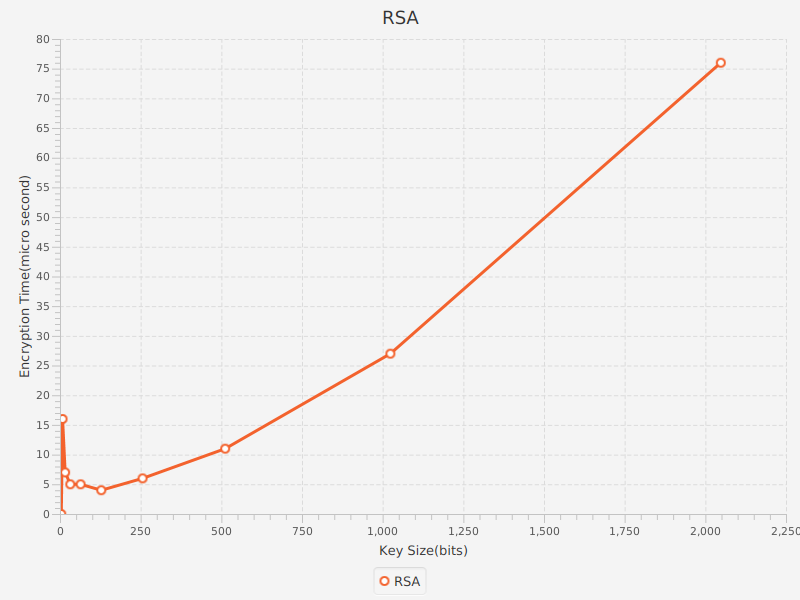
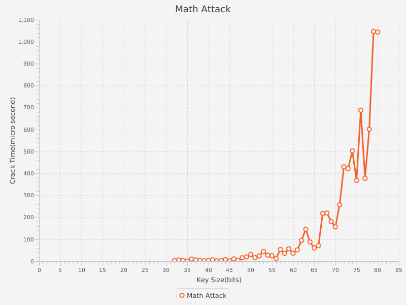

# RSA

- **Keys Generation:**

    For public key(e), we used one of the most common industry values:

        e = 65,537(2 ^ 16 + 1).

    For private key(d) of given size(k), we used a secure random prime number generator to generate the 2 prime numbers(p, q) each of size k/2. Constraints where:

        gcd(phi, e) = 1 where phi = (p - 1) * (q - 1)

    We then used these primes to then generate the modulus(n) and the private key(d), where:

        n = p * q

        d ≡ (e ^ −1) mod phi

&nbsp;

- **Encryption and Decryption:**

    After keys generation, our algorithm can encrypt messages(m) which have been chunked and digitized, and decrypt them back by simple equations:

        enc(m) = (m ^ e) mod n

        dec(em) = (em ^ d) mod n

    Hence, digitized message(m) must be < modulus(n).

    We also compared time taken to encrypt variable lengths messages against different key sizes and came up with this plot:

    

&nbsp;

- **Math Attack:**

    We went forward and implemented a simple math attack with the basic concept of factorizing the modulus(n) to get the 2 primes(p, q) hence obtaining private key(d). We used a variation of Pollard's rho algorithm for the factorization process since n is integer and p and q are of almost equal size. We then came up with this plot:

    

    Starting from key size > 80 started taking more time so we thought it was a good stopping point taking in regard the devices used for this attack weren't designed for performing such intensive processing.

&nbsp;

- **Chosen Cipher Text Attack:**

    We then went on implementing another kind of attacks which is the chosen cipher text attack, with the basic following concepts for encoded message(em), chosen cipher text(cct) - which we chose the value of 2 for -, public key(e), private key(d) and modulus(n):

        enc(cct) = ecct = (cct ^ e) mod n

        mult = ecct * em = (cct ^ e) * (m ^ e) mod n = ((cct * m) ^ e) mod n

        dmult = dec(mult) = ((cct * m) ^ ed) mod n = cct * m

        m = dmult / cct

    Hence, we could retrieve message(m) encoded by a certain instance of RSA using the chosen cipher text(cct).

&nbsp;

- **NB:**

    For calculating the time for the encryption and math attack graphs, we used the time spent by the thread performing these functions on the cpu and to averaged it on multiple runs.